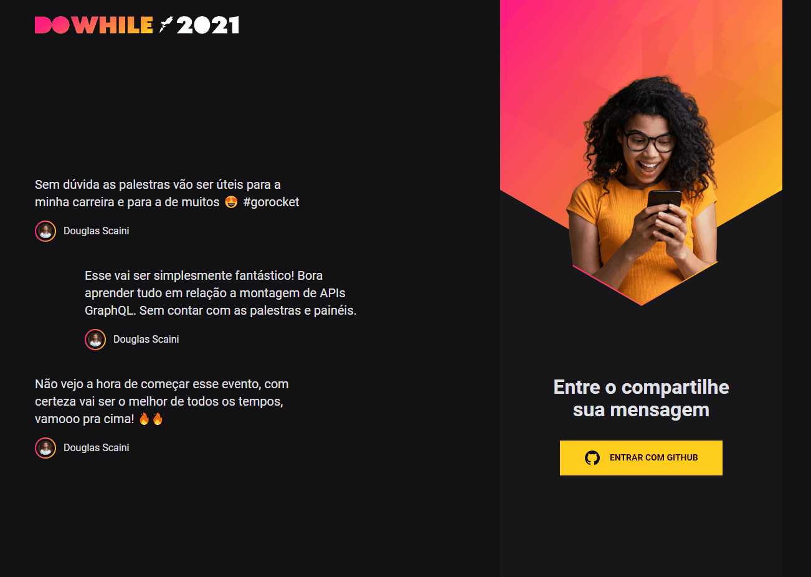

<h1 align="center"></h1>

<h3 align="center">NLW Heat</h3>

<p align="center">“Software developers are students forever 🧠”</p>

<p align="center">
  <a href="#about">Sobre</a>&nbsp;&nbsp;&nbsp;|&nbsp;&nbsp;&nbsp;
  <a href="#install">Instalação</a>&nbsp;&nbsp;&nbsp;|&nbsp;&nbsp;&nbsp;
  <a href="#challenge">Desafios</a>&nbsp;&nbsp;&nbsp;|&nbsp;&nbsp;&nbsp;
  <a href="#technologies">Tecnologias</a>
</p>

## :speech_balloon: Sobre <a name="about"></a>

> #

<br />
<table>
  <tr>
    <td colspan="1">Web App</td>
  </tr>
  <tr>
    <td></td></td>
  </tr>
</table>

## :warning: Instalação <a name="install"></a>

```bash
👉 Back-end

# Instalar as dependências necessárias:
$ yarn

# Configurar as variáveis de ambiente:
$ .env.example to .env

# Rodar as migrations:
$ yarn prisma migrate dev

# Os banco de dados pode ser acessado com:
$ yarn prisma studio

# Iniciar o projeto:
$ yarn dev

```

```bash
👉 Front-end

# Instalar as dependências necessárias:
$ yarn

# Configurar as variáveis de ambiente:
$ .env.example to .env.local

# Iniciar o projeto:
$ yarn dev
```

## :triangular_flag_on_post: Desafio <a name="challenge"></a>

> #

## :heavy_check_mark: Tecnologias <a name="technologies"></a>

- [Vite](https://vitejs.dev/)
- [Prisma](https://www.prisma.io/)

---

by [Douglas Scaini](https://www.github.com/douglasscaini) ❤️
